Certainly! If you create a folder called `images` in your GitHub repository and place all your image files into this folder, you'll need to update the image paths in your Markdown file to point to the images within the `images` folder.

Here's how your Markdown would look:

---

# Lab Report: Continuous Integration/Delivery with Jenkins

In this lab assignment, we set up a build pipeline using Jenkins and Docker to automate the building, testing, and deployment of a sample application. This report documents the steps taken, including configurations, commands used, and screenshots of the process.

---

## Table of Contents

- [Learning Goals](#learning-goals)
- [1. Setting Up the Lab Environment](#1-setting-up-the-lab-environment)
  - [1.1. Configuring Git](#11-configuring-git)
  - [1.2. Creating a GitHub Repository](#12-creating-a-github-repository)
- [2. Building and Verifying the Sample Application](#2-building-and-verifying-the-sample-application)
- [3. Downloading and Running the Jenkins Docker Image](#3-downloading-and-running-the-jenkins-docker-image)
- [4. Configuring Jenkins](#4-configuring-jenkins)
- [5. Using Jenkins to Build the Application](#5-using-jenkins-to-build-the-application)
  - [5.1. Creating a Build Job](#51-creating-a-build-job)
  - [5.2. Configuring Build Steps](#52-configuring-build-steps)
  - [5.3. Running the Build Job](#53-running-the-build-job)
- [6. Adding a Job to Test the Application](#6-adding-a-job-to-test-the-application)
- [7. Creating a Build Pipeline](#7-creating-a-build-pipeline)
  - [7.1. Using a Jenkinsfile](#71-using-a-jenkinsfile)
- [8. Making a Change in the Application](#8-making-a-change-in-the-application)
- [Reflection](#reflection)
- [Screenshots](#screenshots)

---

## Learning Goals

- Installing and running Jenkins in a Docker container
- Creating simple jobs and build pipelines
- Running the pipeline to build and test an application, and to deploy changes in the application

---

## 1. Setting Up the Lab Environment

### 1.1. Configuring Git

First, we configured Git with our user information to ensure proper commit attribution.

```bash
git config --global user.name "Your Name"
git config --global user.email "your.email@example.com"
git config --global --list
```


### 1.2. Creating a GitHub Repository

We created a new Git repository for the sample application.

- **Initialized a new Git repository locally:**

  ```bash
  git init
  ```

- **Added the starter code and made the initial commit:**

  ```bash
  git add .
  git commit -m "Initial commit of sample application"
  ```

- **Created a new repository on GitHub and linked it:**

  ```bash
  git remote add origin https://github.com/YourUsername/cicd-sample-app.git
  git push -u origin main
  ```

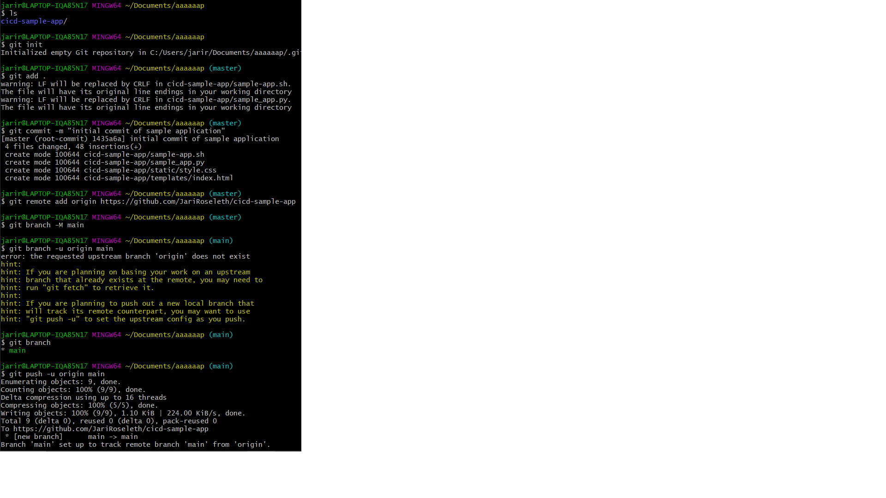

---

## 2. Building and Verifying the Sample Application

- **Navigated to the application directory and made the build script executable:**

  ```bash
  cd /vagrant/cicd-sample-app
  chmod +x sample-app.sh
  ```

- **Built the application:**

  ```bash
  ./sample-app.sh
  ```

- **Verified the application is running:**

  Accessed [http://192.168.56.20:5050/](http://192.168.56.20:5050/) and saw:

  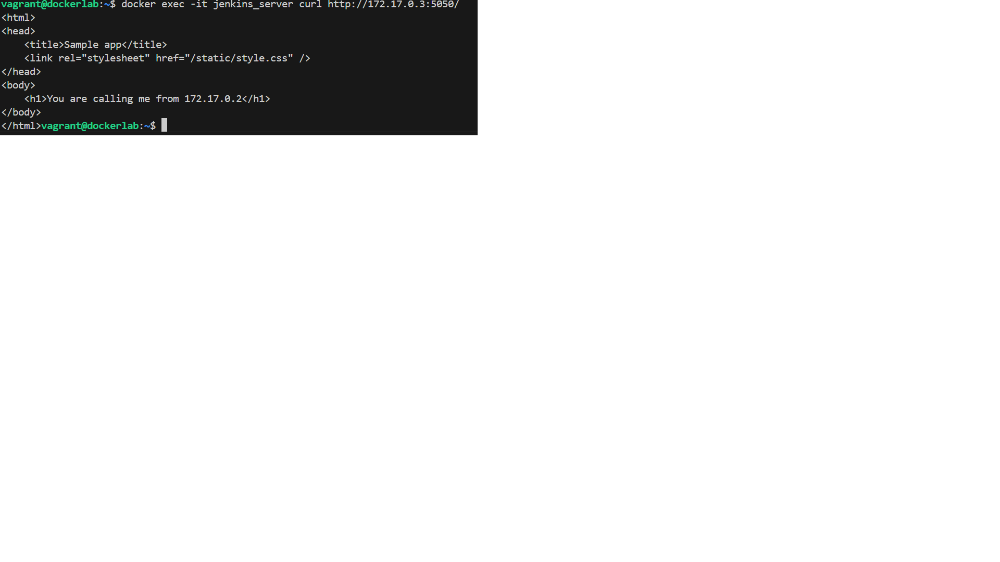

- **Stopped and removed the container:**

  ```bash
  docker stop samplerunning
  docker rm samplerunning
  ```

---

## 3. Downloading and Running the Jenkins Docker Image

- **Pulled the Jenkins image:**

  ```bash
  docker pull jenkins/jenkins:lts
  ```

- **Started the Jenkins container:**

  ```bash
  docker run -p 8080:8080 -u root \
    -v jenkins-data:/var/jenkins_home \
    -v $(which docker):/usr/bin/docker \
    -v /var/run/docker.sock:/var/run/docker.sock \
    -v "$HOME":/home \
    --name jenkins_server jenkins/jenkins:lts
  ```

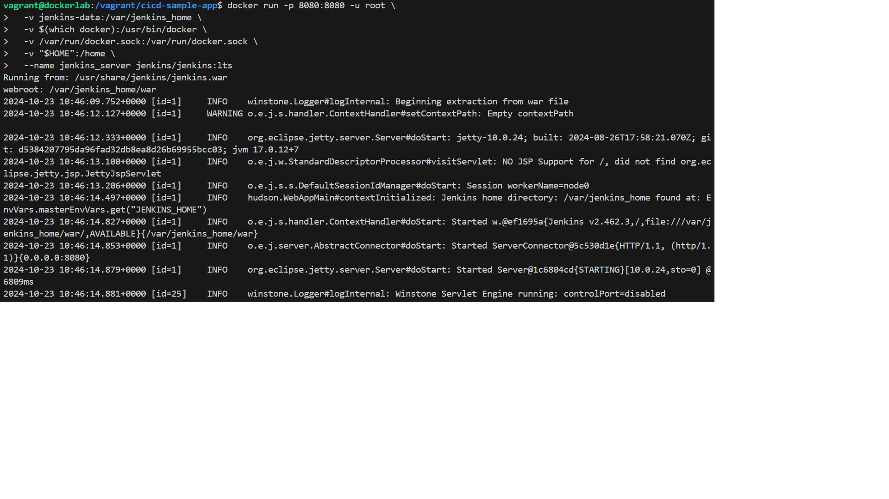

- **Recorded the initial admin password for Jenkins.**

---

## 4. Configuring Jenkins

- **Accessed Jenkins at [http://192.168.56.20:8080/](http://192.168.56.20:8080/).**
- **Unlocked Jenkins using the initial admin password.**
- **Installed suggested plugins.**
- **Skipped creating a new admin user to continue as `admin`.**
- **Saved the instance configuration and started using Jenkins.**

---

## 5. Using Jenkins to Build the Application

### 5.1. Creating a Build Job

- **Created a new freestyle project named `BuildSampleApp`.**

  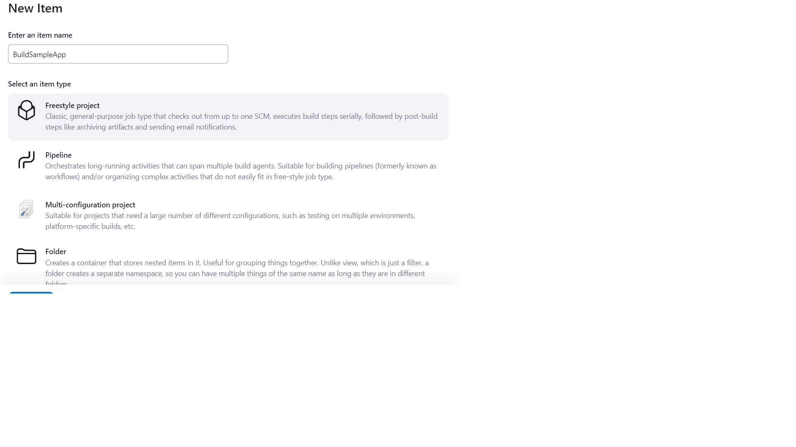

### 5.2. Configuring Build Steps

- **Set up Source Code Management to use Git and specified the repository URL.**

  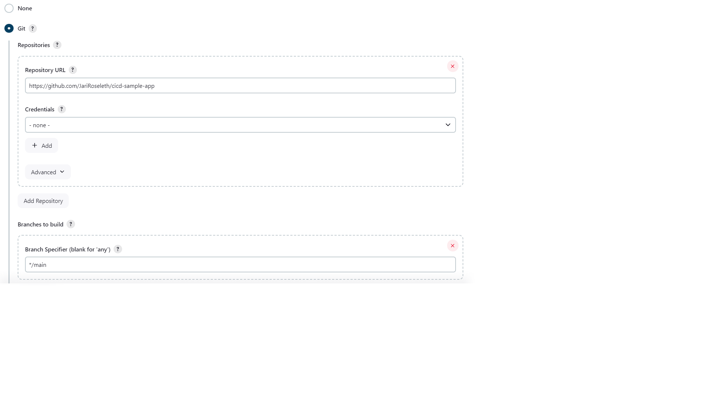

- **Changed the branch specifier to `*/main`.**
- **Added a build step to execute the shell command:**

  ```bash
  bash ./sample-app.sh
  ```

### 5.3. Running the Build Job

- **Ran the build job by clicking `Build Now`.**
- **Verified that the application is running by accessing it in the browser.**

  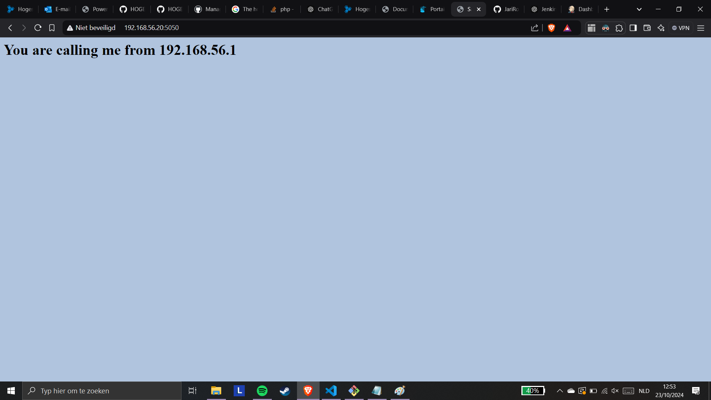

---

## 6. Adding a Job to Test the Application

- **Created a new freestyle project named `TestSampleApp`.**
- **Configured it to build after `BuildSampleApp` completes.**

  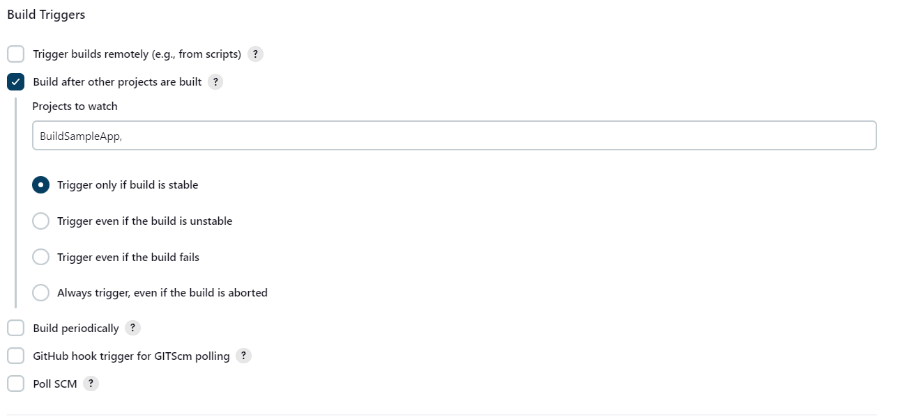

- **Added a build step to execute the shell command to test the application:**

  ```bash
  RESPONSE=$(curl -s http://APP_IP:5050/)
  echo "$RESPONSE" | grep "You are calling me from JENKINS_IP"
  ```

  *Replaced `APP_IP` and `JENKINS_IP` with the actual IP addresses.*

- **Ran the test job and verified that it succeeded.**

  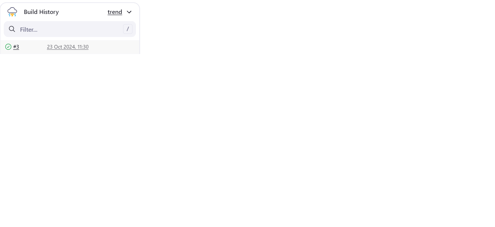

---

## 7. Creating a Build Pipeline

- **Created a new pipeline job named `SampleAppPipelineWithJenkinsfile`.**

  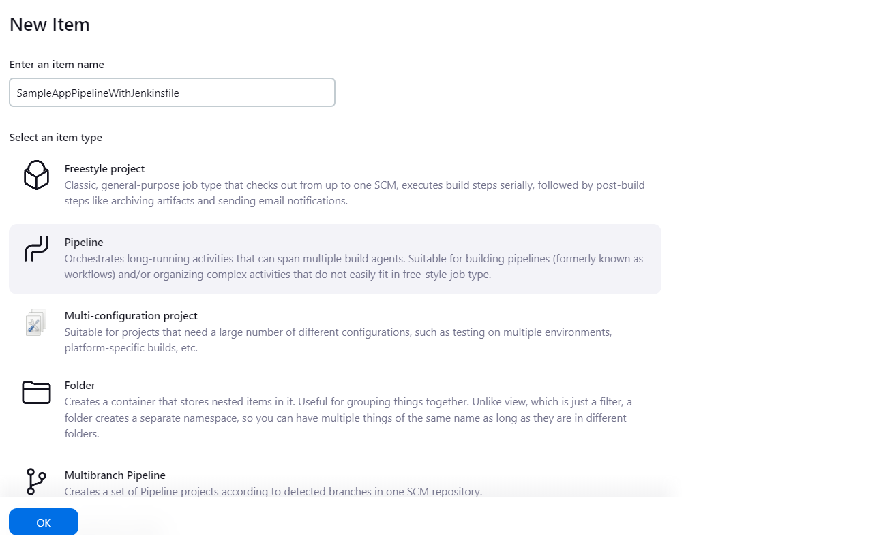

### 7.1. Using a Jenkinsfile

- **Added a `Jenkinsfile` to the root of the repository:**

  ```
  node {
    stage('Preparation') {
        catchError(buildResult: 'SUCCESS') {
            sh 'docker stop samplerunning || true'
            sh 'docker rm samplerunning || true'
        }
    }
    stage('Build') {
        build 'BuildSampleApp'
    }
    stage('Test') {
        build 'TestTSampleApp'
    }
}

  ```

- **Configured the pipeline to use the Jenkinsfile from SCM:**

  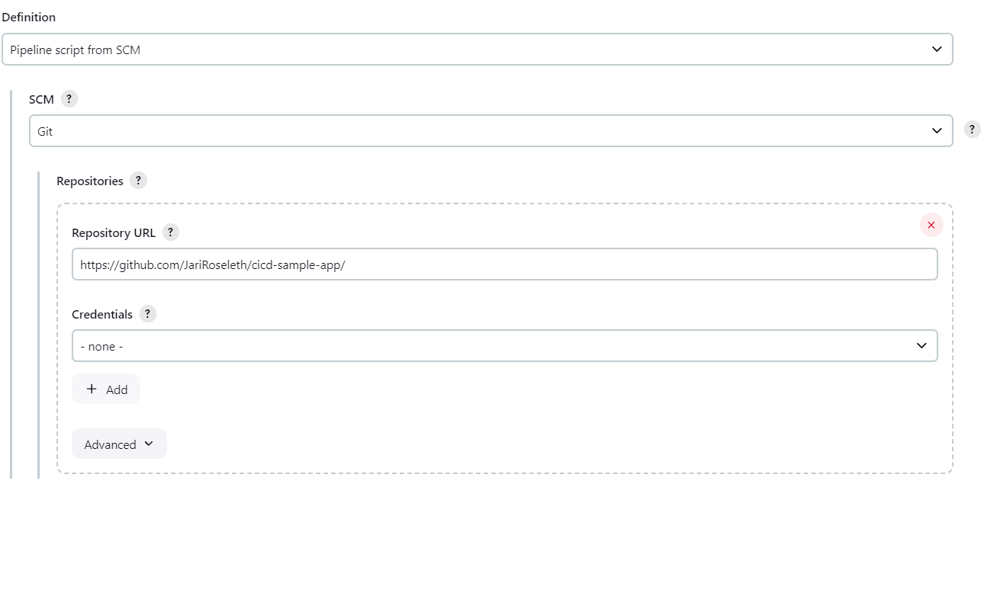

- **Ran the pipeline and verified that it succeeded.**

  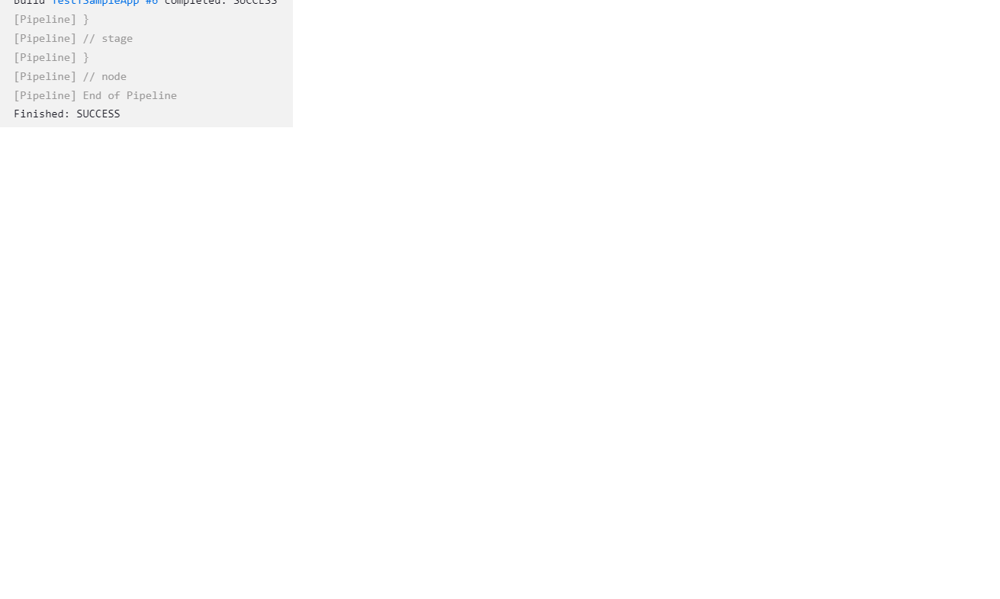

---

## 8. Making a Change in the Application

- **Modified `static/style.css` to change the background color:**

  ```css
  body {
      background-color: lightcoral;
  }
  ```

- **Committed and pushed the changes to GitHub:**

  ```bash
  git add static/style.css
  git commit -m "Change background color"
  git push
  ```

  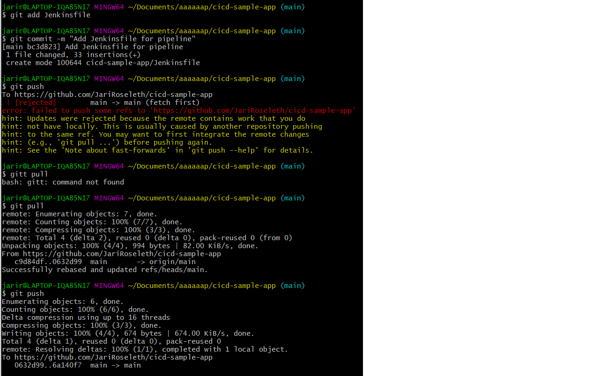

- **Ran the pipeline again in Jenkins.**

  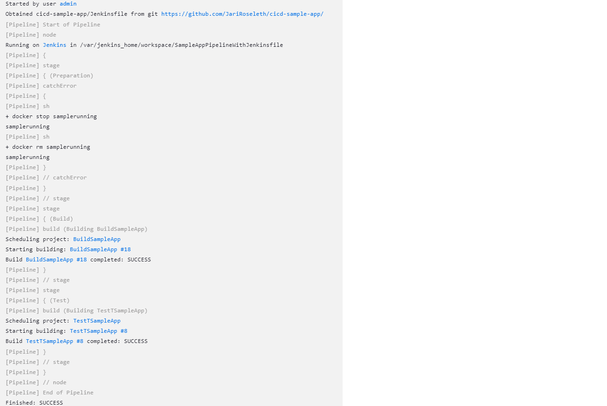

- **Verified that the application reflects the changes:**

  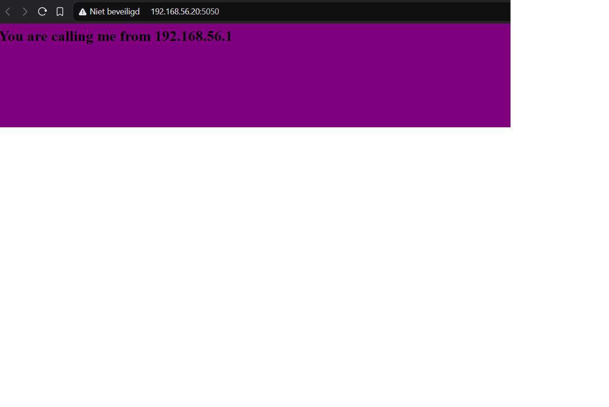

---

## Reflection

This lab assignment demonstrated how to set up a basic CI/CD pipeline using Jenkins and Docker. Through this exercise, we:

- **Configured Jenkins to automate the build, test, and deployment processes.**
- **Learned how to handle common issues such as container conflicts and workspace cleanup.**
- **Understood the importance of script robustness and proper error handling in automation scripts.**
- **Experienced how changes in the codebase can be automatically integrated and deployed through the pipeline.**

---

## Screenshots

Below are the screenshots referenced throughout the lab report:

1. **Git Config Globals**

   

2. **New GitHub Repository**

   

3. **Application Running**

   

4. **Starting Jenkins**

   

5. **Create Job in Jenkins**

   

6. **Jenkins Build Steps**

   

7. **Application Running After Build**

   

8. **TestSampleApp Build Triggers**

   

9. **TestSampleApp Builds**

   

10. **Creating Pipeline with Jenkinsfile**

    

11. **Definition Pipeline with Jenkinsfile**

    

12. **Pipeline Succeeds**

    

13. **Add Jenkinsfile to Git**

    

14. **Automated Pipeline Succeeds**

    

15. **Background Color Changed**

    

---

